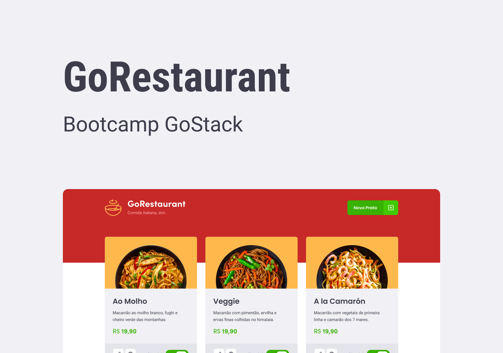

# [Challenge 10 - ReactJS CRUD - GoRestaurant](https://github.com/Rocketseat/gostack-template-reactjs-crud)

This challenge consists of the development of a CRUD interface for a restaurant app.

## 💻 Installation
Clone the application and install the dependencies

```
$ git clone git@github.com:cleiver/GoStack11-Desafio02-conceitos-nodejs.git

$ yarn
```

## Running the application

First run the fake api with some data, then run the application

```
$ yarn json-server server.json -p 3333

$ yarn start
```

## Running the tests

```
yarn test
```

